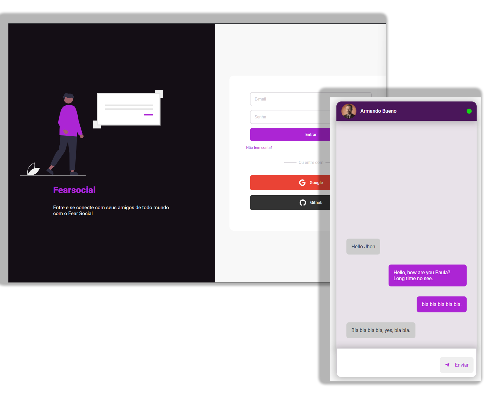
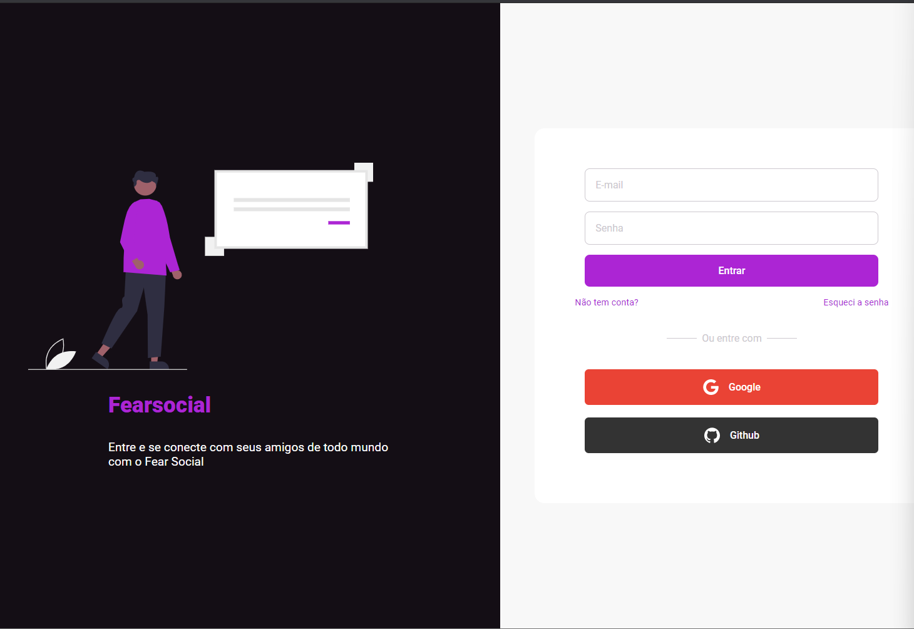
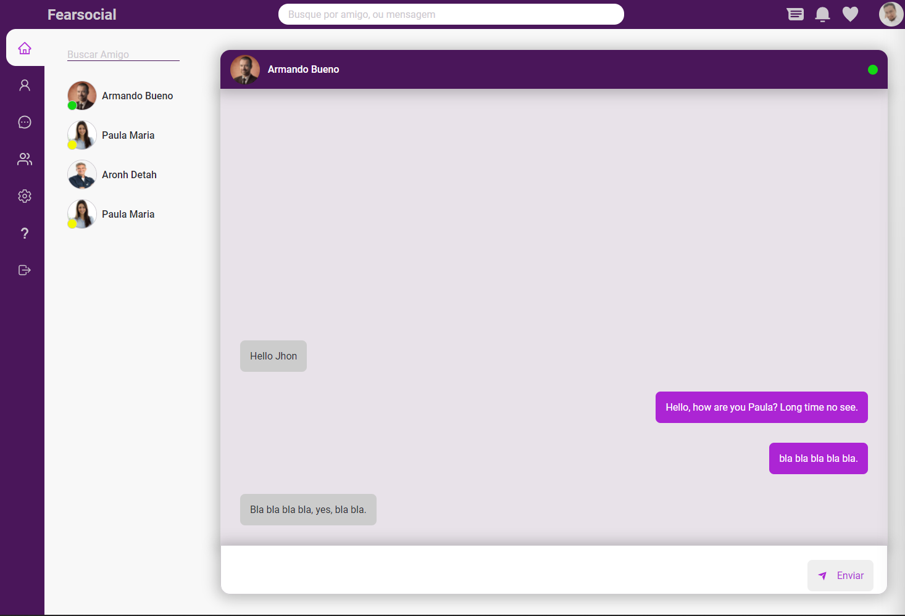
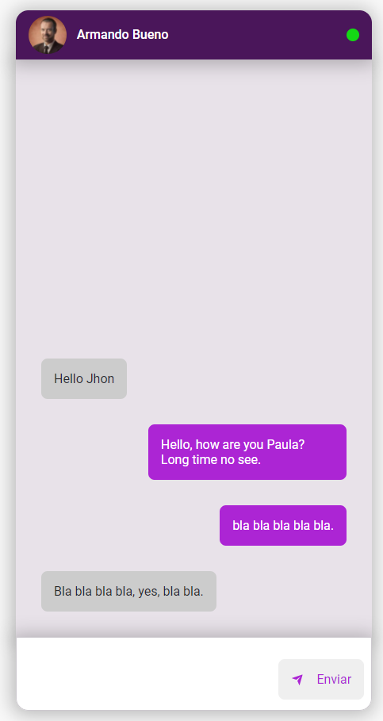

<h1 align="center">
    Chat Messenger
</h1>

  <a href="#-tecnologias">Tecnologias</a>&nbsp;&nbsp;&nbsp;|&nbsp;&nbsp;&nbsp;
  <a href="#-projeto">Projeto</a>&nbsp;&nbsp;&nbsp;|&nbsp;&nbsp;&nbsp;
  <a href="#-layout">Layout</a>&nbsp;&nbsp;&nbsp;|&nbsp;&nbsp;&nbsp;
  <a href="#memo-licença">Licença</a>

 

  

 

  

## 🚀 Tecnologias

#### Esse projeto foi desenvolvido com as seguintes tecnologias:

## 💻 Projeto

O Fearsocial é um projeto que desenvolve uma aplicação de chat, com cadastro de usuários, conexão entre usuários, e chat disponível para usuários conectados.

## 🔖 Layout

- Layout responsivo usando HTML/SCSS

## 🧠 Projeto em desenvolvimento

#### Estado atual
- [x] cadastro de usuário com email/senha, google_account, github
- [x] contexto de usuários dentro do React
- [ ] verificação de usuário via email
- [ ] conexão entre usuários
- [x] conexão com Realtime Database
- [ ] chat enre usuários conectados

## :memo: Licença

Esse projeto está sob a licença MIT.

---
